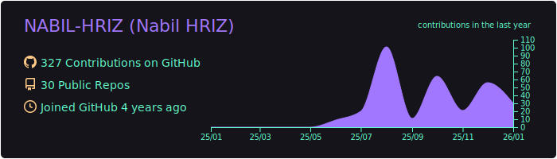
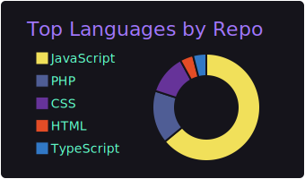
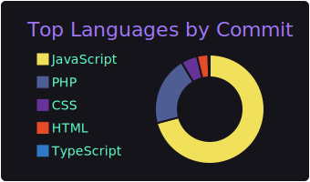
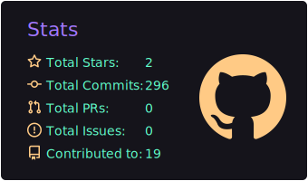
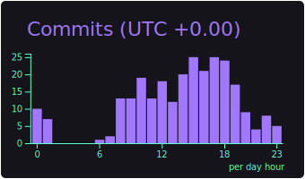

<div align="center">
  
[](https://git.io/typing-svg)

<p align="center">

</p>
</div>

---

### 🚀 À propos de moi

Développeur Full Stack avec un esprit créatif et designer maîtrisant le Front et le Back[cite: 8]. Je conçois des applications web modernes, bien architecturées et performantes[cite: 8]. [cite_start]Actuellement à la recherche d'une nouvelle opportunité pour mettre mes compétences au service de projets ambitieux[cite: 9].

- 🌍 Basé au Maroc.
- 🎓 Diplômé de la **Simplon Academy** (Full Stack React & Laravel) et titulaire d'une **Licence SMI**.
- 🛠 Expertise en **React.js**, **Laravel**, et conteneurisation avec **CI/CD & Docker**
- 💻 Découvrez mon univers : [nabilhriz.vercel.app](https://nabilhriz.vercel.app/)

---

### 🛠 Technologies & Outils

<div align="left">
  <!-- Primary stack (larger) -->
  
  
  
  
  
  
  
  
  
  
  
  
  

  <br />

  <!-- Backend & tools -->
  
  
  
  
  
  
  
  
  
  
  
  
  

  <br />

  <!-- CI / testing / docs / CMS -->
  
  
  
  
  
  
  
  
  
</div>

---

### 📁 Réalisations Majeures

- **FANZONE (CAN 2025)** : Plateforme Full-Stack (React/Laravel) pour la gestion de 10+ Fan Zones, incluant e-tickets QR et Stripe[cite: 22].
- **EVENTIFY** : Application de gestion d'événements avec API REST, Stripe et pipelines CI/CD[cite: 24, 25].
- **FOODIEAPP** : Application de commande en ligne développée avec React et Redux[cite: 26, 27].

- // Voir plus de projets : [Mes dépôts](https://github.com/NABIL-HRIZ?tab=repositories)

---

### 📫 Contact & Social

<div align="center">
  <a href="mailto:hariznabil663@gmail.com" target="_blank">
    
  </a>
  <a href="https://github.com/NABIL-HRIZ" target="_blank">
    
  </a>
  <a href="https://www.linkedin.com/in/nabil-hriz-0937b1390/" target="_blank">
  
</a>
  <a href="https://nabilhriz.vercel.app/" target="_blank">
    
  </a>
</div>

---

<picture>
  <source media="(prefers-color-scheme: dark)" srcset="https://raw.githubusercontent.com/NABIL-HRIZ/NABIL-HRIZ/output/github-contribution-grid-snake-dark.svg">
  <source media="(prefers-color-scheme: light)" srcset="https://raw.githubusercontent.com/NABIL-HRIZ/NABIL-HRIZ/output/github-contribution-grid-snake.svg">
  
</picture>

[](https://github.com/NABIL-HRIZ)
[](https://github.com/NABIL-HRIZ)

<h3 align="center">
✨ Merci de votre visite ! N'hésitez pas à me contacter pour collaborer sur des projets passionnants. ✨  
</h3>

---

## 📇 Stats & Profile Summary Cards

You can embed automatically-generated profile cards. Run the `Generate Datas` workflow (Actions) to refresh them. Example embeds (served via raw.githack for reliable SVG rendering):

```
[](https://github.com/vn7n24fzkq/github-profile-summary-cards)
[](https://github.com/vn7n24fzkq/github-profile-summary-cards) [](https://github.com/vn7n24fzkq/github-profile-summary-cards)
[](https://github.com/vn7n24fzkq/github-profile-summary-cards) [](https://github.com/vn7n24fzkq/github-profile-summary-cards)
```

Inline (files included in repo):

[](https://github.com/vn7n24fzkq/github-profile-summary-cards)
[](https://github.com/vn7n24fzkq/github-profile-summary-cards) [](https://github.com/vn7n24fzkq/github-profile-summary-cards)
[](https://github.com/vn7n24fzkq/github-profile-summary-cards) [](https://github.com/vn7n24fzkq/github-profile-summary-cards)

Troubleshooting:

- If a card is blank, run the `Generate Datas` workflow in Actions; it generates cards and publishes outputs.
- Open the card directly via the raw.githack link to verify SVG rendering.
